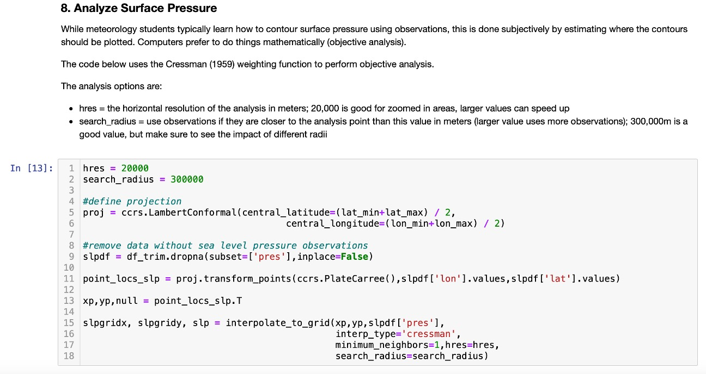

Jupyter Notebooks that Create Weather Charts for Use in Case Studies and Education
********************************************************************************
This software package is a collection of open source Jupyter notebooks that create weather charts for use in reviews of weather events as well as in education. This package is available to be expanded upon.

Motivation
==========
This package was created for 2 purposes: to be used as a tool for education and to make collecting charts for event reviews and case studies easier.

Education
~~~~~~~~~
There are a few barriers of entry that exist for students starting their education in meteorology. One of these barriers is the collection of meteorological data and charts. Data and charts are often spread across multiple agencies and online archives. Students who are early on in their education may not know where to find some of these charts or where to get data from. This package aims to give students a central location to access many different meteorological charts. Another barrier to entry for students is a knowledge of programming languages used in meteorology. Some students may have very limited knowledge of programming, if any at all. Since some charts are not archived or are only archived for a short time, they must be entirely recreated to show the same features. This can be done if the raw data was archived, but this is most easily done through programming. This package not only provides the scripts to obtain these charts, it also presents the notebooks in a way to promote learning for students.

Using Jupyter notebooks for this project was not done on accident: Jupyter notebooks have been found to be effective tools for education. Barba et al. 2019 says, “We believe that incorporating Jupyter notebooks in our teaching has allowed us to improve students’ understanding of course content, increase student engagement with material and their participation in class, and to make concepts more meaningful and relevant to students’ diverse interests.” An adjunct professor of computer science for Central Connecticut State University, Roland DePratti, agreed with this sentiment in his 2019 paper. He stated, “Jupyter Notebooks are an effective way to give hands-on training in a programming language without the need for additional textbooks" (DePratti, 2019). Wageningen University in the Netherlands uses Jupyter notebooks in a weather forecasting class, as described in their 2022 paper, where they cite Jupyter notebooks as "the leading analysis tool." They use them to visualize concepts and to help the students get experience with programming. In one assignment, students create a flowchart of input and manipulation steps as a way to structure the Jupyter notebooks they create to plot their forecasts. This helps the students to think about strategies for data management, programming structure, and data visualization. 

Case Studies
~~~~~~~~~~~~
Case studies and reviews of weather events were another area that this package was designed to benefit. Operational meteorologists typically do reviews of weather events to identify common features in storms in an attempt to improve their forecasting. However, operational meteorologists have many duties to perform and reviews of weather events can be time-consuming. As such, reviews of weather events usually are limited to only the most impactful events. This has led to an increase in *false alarms* - forecasts which overestimate the weather impacts (Ramage et al. 1993). One part of the event review process that makes them time consuming is the collection of charts and data. As mentioned above, if these weather charts are archived somewhere, they are often scattered across multiple agencies and online archives. Otherwise they must be recreated. Having a central place to obtain weather charts from scripts will greatly reduce the amount of time it takes for operational meteorologists to perform reviews of weather events by getting them away from the collection of charts and the programming side of things. This allows them to focus on the analysis of the event instead. As a result, operational meteorologists will be able to perform reviews of less impactful weather events, increasing their understanding and forecasting of such events and reducing the number of false alarms.

How to use this package
=======================
This package has been designed to be used both educationally, by instructors and students, and operationally, by meteorologists. 

Instructors 
~~~~~~~~~~~
Instructors can use notebooks in this package as exercises for students to go through to help them understand how they can use programming to download data from a dataset and plot that data on a weather chart. They also can use notebooks as an exercise to help students visualize different meteorology concepts, such as objective analysis. Notebooks are currently set up to be used as exercises. Instructors can also adapt notebooks to be used as assignments for students to complete, providing students hands-on experience with programming.

Students
~~~~~~~~
Students can use notebooks in this package to obtain weather charts for case studies and forecasting assignments. They can input the date and time they would like weather charts for, run the script, and then save those figures for their project. Notebooks can also be used by students as a resource to study for programming exams or to help them if they get stuck on a programming question in the future. 

Operational Meteorologists
~~~~~~~~~~~~~~~~~~~~~~~~~~
Operational meteorologists can use notebooks in this package to obtain charts, such as satellite, upper air, and surface observations for reviews of weather events. 

Example of how changing the code changes the output
===================================================
One example of how changing part of the script changes the output is in the `surface analysis <https://github.com/josh-nielsen/Non_Thesis_Project/blob/main/scripts_for_testing/surface_analysis_declarative.ipynb>`_ code. Changing the search radius will impact how the contours are plotted. 

Changing the value for the variable search_radius will affect the surface pressure contours. For example, a value of 100,000m will result in the plot below:

  
If the search radius is changed to 500,000m, the following plot will be the result:

Creating environment from the environment.yml file
===================================
Using Anaconda or Miniconda, it is recommended to create a new envrionment from the `environment.yml <https://github.com/josh-nielsen/Non_Thesis_Project/blob/main/environment.yml>`_ file. To create this environment:
::
  conda env create -f environment.yml

To activate the new environment:
::
  conda activate wx_plots

References
==========
Barba, L. A., Zingale, M., Willing, C., Wickes, E., West, R. H., Watkins, R. R., Niemeyer, K. E., Lippert, D., Moore, J. K., Mandli, K. T., Heagy, L. J., George, T., Downey, A. B., Brown, J., Blank, D. S., & Barker, L. J. (2019, December 6). Teaching and learning with Jupyter - GitHub Pages. Teaching and Learning with Jupyter. Retrieved April 26, 2023, from https://jupyter4edu.github.io/jupyter-edu-book/index.html 

DePratti, R. (2019). Using Jupyter Notebooks in a Big Data Programming Course. Journal of Computing Sciences in Colleges, 34(6), 157–159. 

Galen, L. van, Hartogensis, O., Benedict, I., & Steeneveld, G.-J. (2022). Teaching a weather forecasting class in the 2020s. Bulletin of the American Meteorological Society, 103(2), E248–E265. https://doi.org/10.1175/bams-d-20-0107.1 

Ramage, C. S., 1993: Forecasting in meteorology. Bull. Amer. Meteor. Soc., 74, 1863-1872, doi:10.1175/1520-0477(1993)074<1863:FIM>2.0.CO;2. 
